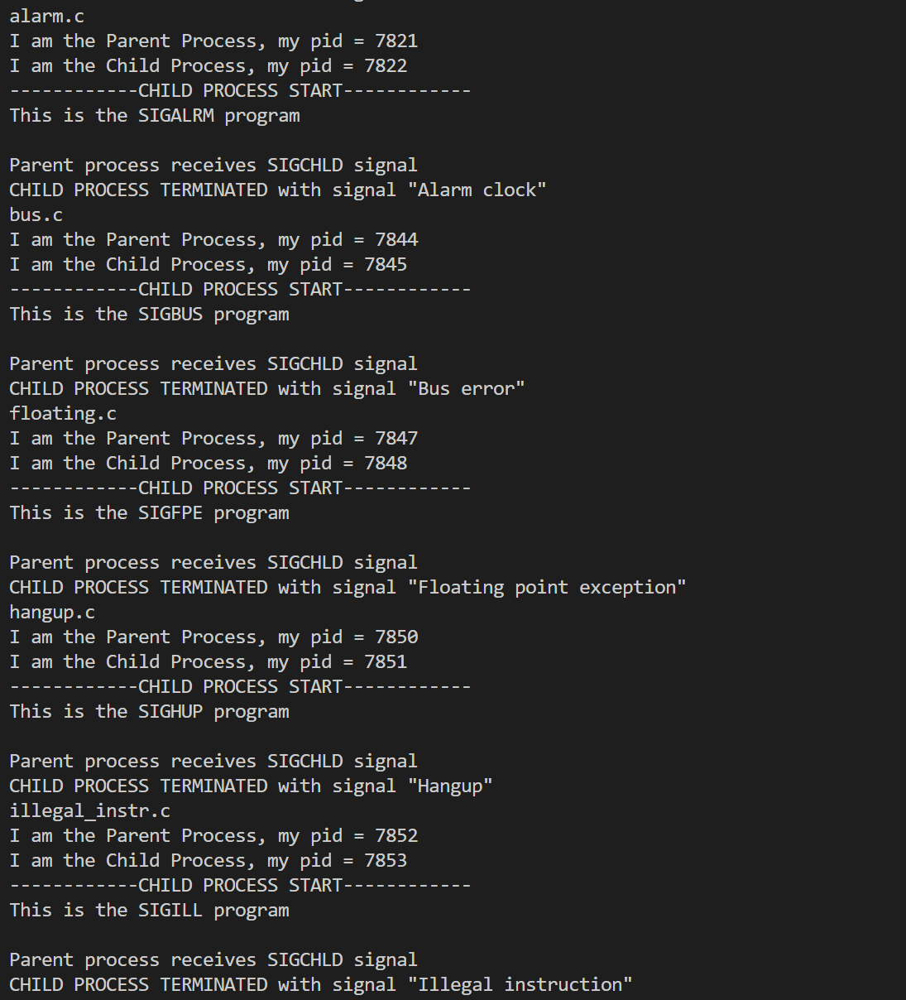

# CSC3150 Assignment 1

Li Dongming, 119020023

## Program Design

### Program 1

1. Fork a child process
2. if the fork is successful, execute the compiled binary program file in the child process using ```execv```
3. using ```waitpid``` to wait for the child process to terminate or stop
4. print out the signal returned by the child process

### Program 2

1. create a child process using ```kernel_clone``` to execute a custom function ```my_exec```
2. in ```my_exec```, use ```do_execve``` to execute the program at ```/tmp/test```
3. in the parent process, use ```do_wait``` to wait for the child process to terminate or stop
4. print out the signal returned by the child process

### Bonus

1. parse the input argument into a ```struct``` for further usage (implemented arguments include: ```-A```, ```-p```, ```-g```, ```-n```, ```-V```. And ```-T``` is implemented and **CANNOT be opted**)
2. get the paths for directories of each process under ```/proc```
3. parse pid, parent pid, command, group pid from ```/proc/[pid]/stat```
4. build a process tree from the parsing result. The children of the tree are implemented as a singly linked list.
5. if necessary, sort the children of each node by the command name
6. print the process tree using recursion according to arguments specified from user input 

## Environment Setup

In program 1 and bonus, a ordinary linux  system is enough, no special setup is needed.

For program 2,

1. download linux system of version 5.10.146
2. modify the source code to export ```do_wait```, ```getname_kernel```, ```do_execve```, ```kernel_clone``` using ```EXPORT_SYMBOL```. If the function is declared as static, remove the ```static``` identifier
3. compile and install the new linux kernel according to tutorial slide.
4. in program 2, declare such kernel functions using ```extern```

## Screenshots

### Program 1




### Program 2


### Bonus


## What I learnt from the tasks

1. documentation is very important and it is extremely difficult for a person not familiar with some code (e.g. Linux kernel) to start playing with them without detailed documentation on what the functions expect and how they work.
2. Don't mess with kernel unless you know what you are doing.
3. Everything is a file in linux.