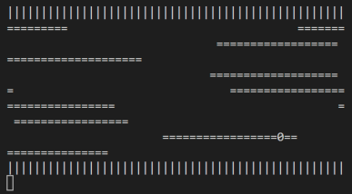

# Assignment 2

Li Dongming, 119020023

## Design of Program (Main Task & Bonus)

### Main Task

1. Besides the main thread, create another two threads, one for moving the logs and another for listening to keyboard hit and move the frog correspondingly. The main thread also takes care of printing the game status too.
2. [main thread] - every 0.01 second, check the game status (win, lose, quit, or playing) and print the game, i.e. ```map```. If the game is ended, i.e. not playing, print corresponding messages. When the game is ended, the main thread exits and other threads will also be terminated automatically.
3. [log_move] - every 0.1 second, move the logs (and the frog on it, and checking whether the frog is out of the game playground) and put them in the global variable ```map```. 
   - Note: different locks are acquired when operating on ```map``` and ```frog```. 
   - Note: **THIS IS A GAME!!!**. So there is some randomness in it. When initializing the game, the positions of the leading logs at each line are randomly initialized to satisfy the constraint that *it is the leading one*. Logs move one space each 0.1 second. The length of the logs at each row are also randomly initialized. In order to make the game looks like the one shown in demo, the spaces between logs at each line are set so that when one is leaving the game playground, the next one is entering with exact to boundaries. I would **STRONGLY DISAPPROVE** to follow the demo exactly because it is against the spirit of creativity and engagingness inherent in games.

4. [player_hit] - every 0.05 second, check whether user hits any keys and perform corresponding action for the frog. It will also check whether the frog is in water every time the frog is moved by user (i.e. lose the game) or is at the other side of the bank (i.e. win the game).

### Bonus

1. Some core ideas of my implementation, although not perfect: 
   - two queues: one for waiting jobs and the other for waiting thread workers (will appear as worker in the following content of this report). 
   - different ```cond_signal``` for different workers, i.e. 5 workers will have 5 different ```cond_signal```. This is designed this way so that we have to choice to schedule the jobs. It would be useful if different workers have different properties, such as workers in different machines in a distributed setting.

2. Workflow:
   - when each new job comes in, first check if there is any worker waiting for jobs. If there is, directly dispatch the incoming job to the available worker (by ```pthread_cond_signal``` and global variables specific for this thread to store job function and job arguments) and remove that worker from worker queue. If multiple workers are available, choose the one at the front of worker queue. However, if all workers are busy, add the incoming job to job queue.
   - when a worker finishes its job, it will look at the job queue. If job queue is empty, simply put itself back to worker queue and wait. If there are jobs in the queue, dequeue the first job from the queue and do the job.

### Environment

For both the main task and bonus, the tested environments are as follows:

- WSL1.0 on Windows 10: kernel version 4.4.0-19041-Microsoft, gcc version 7.5.0, g++ version 7.5.0, Ubuntu version 18.04.
- Virtualbox VM on Windows 10: kernel version 5.10.146, gcc/g++ version 5.4.0, Ubuntu version 16.04.

## Steps to Execute

### Main Task

Use the Makefile to compile. Note that you need to install ncurses library first.

```bash
# in the source code directory
sudo apt-get install libncurses5-dev libncursesw5-dev
make
./hw2
```

### Bonus

Use the Makefile to compile.

```bash
# in the thread_poll directory
make
# use proxy
./httpserver --proxy inst.eecs.berkeley.edu:80 --port 8000 --num-threads 5
# use local file
./httpserver --files files/ --port 8000 --num-threads 5
```

Local file is preferred over proxy because the latter may suffer connection problem.

## Screenshots

### Main Task

Initial state:


Playing:




Game ended:


### Bonus

```async_init```, no incoming jobs:


In job execution, with detailed output of which thread is doing what (this is an option that can be disabled by defining macro):


In execution of 20 paralleled jobs, without detailed output:


Systematic testing:


## What Did I Learn

1. mutex lock
2. working with blocking and non-blocking functions
3. debugging in multithread applications
4. understanding of deadlocks and starvation
5. how to refresh screens