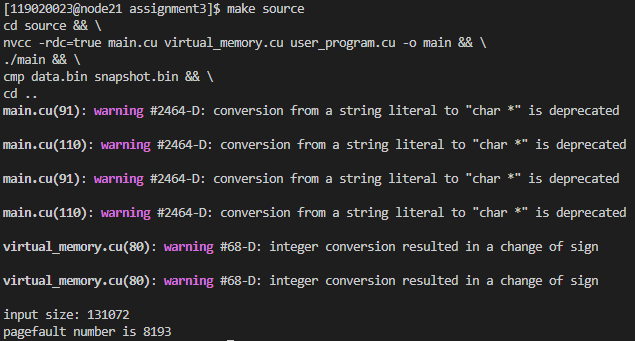

# Assignment 3

## Environment

The cluster provided for this assignment with GPU.

## Steps to Execute

### Main Task

1. go to the corresponding directory (```source``` for main task, ```bonus``` for bonus task)
2. change the ```user_program``` of  ```user_program.cu``` into the test functions. Note that I use some macros to manage my own tests. You can remove the ```TEST1``` macro and replaces the user_program with testcases. You do not need to remove the ```DEBUG``` macro, it manages error message printing. However, the result should not be different if you define ```DEBUG```.
3. in bash, type in ```sbatch slurm.sh```

### Bonus

It is the same except at step 2, you need to specify a macro for version 1 or version 2 implementation. The macro is defined in virtual_memory.h. Note that **Version 3** is not ready yet.

## Design

### Main Task

#### Components

1 inverted page table occupying 4KB shared memory.

1 swap table (also inverted) occupying 16KB global memory.

##### Inverted Page Table

| higher->lower | -                 | --   | -----    | -------------       | -----------     |
| ------------- | ----------------- | ---- | -------- | ------------------- | --------------- |
| # of bits     | 1                 | 2    | 5        | 13                  | 11              |
| Usage         | valid/invalid bit | pid  | not used | virtual page number | counter for LRU |

Each entry of the inverted page table is of 32 bits. The last 11 bits are used as counter (although 10 is enough for 1024 physical mem frames). 13 bits of index 12~24 (inclusive) represent the virtual page number. The second to highest 2 bits (30~31) stores the pid (not used for the task actually, set to 0). The highest bit is the valid/invalid bit.

##### Swap Table

| higher->lower | -                 | ---------------- | --   | -------------       |
| ------------- | ----------------- | ---------------- | ---- | ------------------- |
| # of bits     | 1                 | 16               | 2    | 13                  |
| Usage         | valid/invalid bit | not used         | pid  | virtual page number |

Similar to inverted page table, except that the 11 bits for counter in IPT is removed.

#### Logic

Both ``vm_read`` and ``vm_write`` are based on a core routine ``vm_map_physical``, which takes a virtual address and outputs the physical address, and will swap pages in global memory into shared memory if needed.

##### Logic of ``vm_map_physical``

Input: a virtual address, and Boolean mode indicator which tells the routine whether caller want to write or read.

Output: the physical address, will generate errors by ```assert``` statement if (1) the page that the caller want to read has not been written yet, and (2) global memory to hold swapped contents is full and thus cannot perform swap.

Routine:

1. get the entry as query (referred to as query entry) to the inverted page table from the virtual address

   ***// search in IPT***

2. search over the inverted page table for a matched entry

3. loop over the inverted page table to find the victim frame (if there are free physical frames, it is the least indexed one. If not, it is the least indexed LRU frame)

4. if a matched entry is found, save the frame number to generate physical address. Check whether the physical frame is the most recently frame. If it is, flag it so that the counter will not be increase at the end. Go to step **13**

   ***// page fault, search in swap mem***

5. if no matched entry in IPT, search in the swap table (for a matched entry and also a free swap frame) and increment ``pagefault_num`` by 1

6. if a matched entry is found in the swap table, swap the content of the victim frame and the matched swap frame. Also swap the entry of victim frame in IPT and the entry in swap table (and handle the bit move as  well). Save the victim frame number to generate physical address. Go to step **13**

   ***// handling cases of using a new virtual page***

7. if no matched entry in IPT either, check whether it is in write mode. If it is in write mode, throw an error (the page that the caller want to read has not been written yet)

8. if it is in write mode, check whether the victim frame is free.

9. if the victim frame is free, set the entry of victim frame to the query entry

10. if the victim frame is not free, check whether a free swap frame is found (we need to swap victim frame into storage)

11. if no free swap frame, throw an error (swap mem not enough)

12. otherwise, swap the content of the victim frame into the free swap frame. Also setup the corresponding entry of the swap table and the entry of IPT. Save the victim frame number to generate physical address.

    ***// generate physical address***

13. use the saved physical frame number in step 3 or step 6 or step 12 to generate physical address

    ***// increment the counter***

14. if a flag is set in step **4**, no need to increment the counter. Otherwise, increment counter for every valid physical frame by 1

    ***// return***

15. return the physical address

##### Logic for ``vm_read`` and ``vm_write``

Call ``vm_map_physical`` and indicate whether it is in write mode. 

read: return the content at the physical address.

write: set the content at physical address to specified value.

### Bonus

#### Version 1

Since CUDA is SIMT, we need a lock or something equivalent to stop other threads from overwriting IPT and swap table when one thread is searching for its physical address. However, in my implementation, overwriting is avoided by allowing one thread to read/write every time and other threads just wait and do nothing. This is achieved by assigning the job according to the logical page number of the address. For example, 4k pages are assigned to thread 0. When reading/writing from/to 4k page, only thread 0 is working while other 3 threads do nothing (directly return).

#### Version 2

Since each thread does the same thing and they overwrite each other, nothing is changed from the main task except:

1. ```my_kernel<<<1, 4, INVERT_PAGE_TABLE_SIZE>>>(input_size);``` (launch 4 threads within the same warp)
2. ```atomicAdd(vm->pagefault_num_ptr, 1);``` (so that increments on page fault number will not overwrite each other)

Then, since CUDA GPUs are SIMT in nature, threads of the same warp always execute the same instruction. Therefore, there will be data racing between different threads. Luckily, since different threads are doing the exact same task, it does not matter which thread eventually writes its data to buffer, storage, IPT, or swap table.

## Output (Page Fault Number)

### Main Task

Original test case: 8193

Explanation: 

The program first write 4K page of contents sequentially. So there will be 4K page faults during writes. 

Then the program reads 1K pages and 1B content backwardly. Because using LRU, after writing the last 1K virtual pages should be on shared memory (physical mem). Therefore, the first 1K page reads do not generate page fault. Only the 1B read gives a page fault. 

Then in snapshot, the program reads sequential from the 0x0 up to 128KB. Since none of them is in physical mem when reading, there should be 4K page faults.

Therefore, the total page faults is 4K+1+4K=8193.


Additional test case on BB: 9215

Explanation:

First 4K page of contents to write, starting from virtual page 1K+1 (least index is 1). Therefore, 4K page faults.

Then write contents into virtual pages 1~1K-1. Therefore, 1023 page faults.

Then the snapshot starts at page 1K+1. Therefore, 4K page faults.

Total page faults: 4K+1023+4K=9215

### Bonus

#### Version 1

Since it is exactly the same as the main task except that the jobs are divided into 4 threads (no concurrency at all), the page fault number should be the same. Therefore, it is 8193 and 9215 respectively.

#### Version 2

Since the four threads are doing the same thing and overwrite each other, the page fault number should be four times the single-thread one. Hence, for the original test program: 32772. For the additional test program: 36860.

## Problems

### LRU Design

Use a counter to record the how recently the frame has been used.

### Swap Mechanism

Use a temporary ``uchar`` on register to perform swapping contents between physical mem and swap storage. In this implementation, the swap storage is maximally used in the sense that the maximum virtual space is physical mem space plus swap storage space.

## Screenshots

### Main Task




### Bonus

#### Version 1


#### Version 2


## Lesson Learned

1. How virtual memory works. At which stage the virtual memory address is transformed into physical memory address.
2. basic CUDA programing, atomic operations, SIMT.