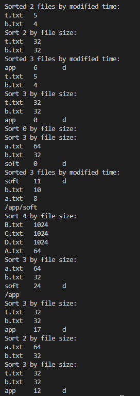

# Report

## Environment

For both the main task and the bonus, the environment is the cluster prepared by this course.

## Execution Steps

For both the main task and the bonus:

- go to the corresponding directory of the main task and bonus.

- write the testing program in ``user_program.cu``.
- run ``sbatch slurm.sh`` in bash.

## Design

### Main Task: Without Directory Structure

#### Logic

File control blocks (FCBs) stores enough information to locate the file and other metadata for sort, including

- file name: 20B
- created time: 2B
- modified time: 2B
- file size in bytes: 4B
- start block index: 4B

When any operation on any file happens, the file system first retrieves the corresponding FCB, and then operates on the FCB and the corresponding data blocks to perform the operation.

#### Open

1. search for the corresponding FCB by file name. If not found, search for an empty FCB.
2. if not found and in write mode, create a 0B file (i.e. null start block id, 0 file size)
3. return the index of the FCB

#### Read

1. retrieve FCB by FCB index
2. calculate the start position of data by FCB
3. read

#### Write

1. retrieve FCB by FCB index
2. remove file content, i.e. set the superblocks to be free and set file size to 0
3. search for a large enough contiguous free space. If not found, do file compaction and search again.
4. set metadata for the FCB, including time, start block index, and file size
5. write to data blocks and flag those blocks as used.

#### Remove a File

1. search FCB by name
2. remove file content
3. remove FCB

#### List Files

1. collect all valid FCBs
2. sort according to user specifications
3. print out the message

#### File Compaction

1. collect all valid FCB (of non-empty files)
2. sort according to starting block index
3. compact files according to starting block index

### Bonus

#### Logic

Most of the logic is the same of the main task. This section will only present those that are different.

FCB contains information about:

- file name: 20B
- created time: 2B
- modified time: 2B
- file size in bytes: 2B
- start block index: 2B
- parent directory FCB index: 2B
- directory indicator: boolean but occupy 2B

The tree structure is maintained by the parent index of each file (including directory). The FCB for a file under a specific directory can be uniquely found by searching over all FCBs whose parent index points to the directory. *Note* that this is definitely not a good design, since the time complexity to retrieve a child file is O(n). Because the assignment does not focus on efficiency, I do not bother to improve the implementation to O(1) by using a left-child-right-sibling representation of trees.

Another thing to note is that in my implementation, directories do not occupy any block, although they can have a non-zero size.

#### File Creation

Besides regular steps in the main task, it also need to update the parent index to point to the current directory and increase the parent directory size accordingly.

#### Directory Deletion

An entire directory is removed using a post-order traversal, implemented using stack. Note that when a file is deleted, the parent directory size should be updated accordingly.

#### Change Directory

A new variable of the file system is used to store the FCB index of the current directory. When changing directory, just update the FCB index accordingly.

## Problems Met

### How to Allocate Blocks for Files

At first, since it is stated explicitly that there are at most 1024 files and the max size for files is 1024B, I believe there is definitely no need to compact the files. Thanks to piazza and the Wechat group, I learn that there are files larger than 1KB in test cases (**Pity that this piece of information is not announce on BB**). Therefore, I implement the file compaction in the end.

### How to Organize the Codes

I used a lot of more primitive (helper) function in the assignment, especially the bonus. I use a total of 34 other functions to implement and debug. Things begin to be messy when there are 15+ other functions. I still do not have a good solution for this problem.

### How to Maximally Reuse the Logic

A lot of things are similar or the same in the main task and bonus. It is really a important design problem to share common logic. My solution is that both tasks have a set of common FCB getters and setters function protocol but different implementation. I also use pointer conversion and reference to avoid adding setters functions. However, there may be alignment issue when converting pointers and U.B. may be hit. But I do not run into the problem on the cluster environment. **Please Test MY CODE on the CLUSTER.**

## Screenshot

### Main Task

Since test case 3 and 4 have a output too long to do a screenshot, I only post screenshots of test case 1 and 2 here.

### Bonus

## What I learn

It is important to have a good design and organized codes.